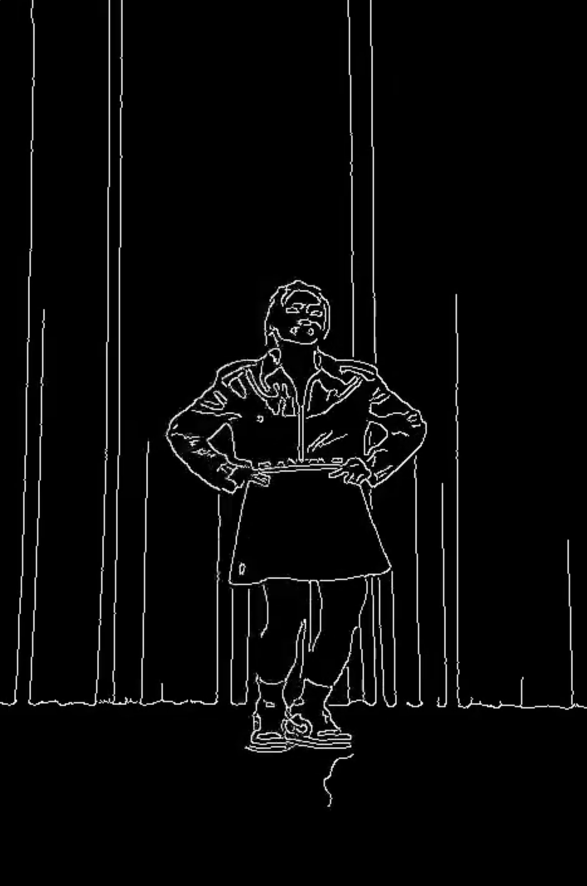

# Go Dance Up App 프로젝트

# 1. Process

---

# 2. 모듈 상세 설명

1. dance_angle.py
* calculate_angle method : 랜드마크 3개로 중심 관절 각도 계산 함수
* 평가 하고자 하는 관절 조합 설정 (예: 양쪽 팔꿈치, 무릎, 골반 등)
* user, origin 프레임 처리 (.npy파일로 각 조합 각도 추출)
* 각 npy 파일 저장 (평가 데이터로 사용)

2. evaluate.py
* 프레임 길이 같게 조정
* calculate_score method :  Perfect~Miss까지 5단계로 매칭 점수 범위 설정
* orin - user 각도 차이 계산
* 각 프레임 별로 차이 계산 후 calculate_score 함수로 점수 출력

3. feedback_score.py
* 진행 과정 영상으로 시각화 모듈

---

# 3. 리팩토링 모듈

1. ft_dance_angle.py : 아래 두 함수로 업로드 된 사용자 영상 처리 (추후 실시간 스트림으로 변경)
* def calculate_angle 
* def process_user_video, def : 사용자 영상으로 조합 별 각도를 .npy로 저장

2. ft_evaluator.py : 평가 메소드 설정
* def calculate_score
* def evaluate_angles : 각도 차이 계산 후 프레임 별 차이 계산으로 점수 출력

3. main.py : server App 실행 파일 (fastAPI 활용)
* /upload_and_evaluate 엔드 포인트 정의

---

# 3. Test
* docs로 서버에서 잘 처리하는 지 확인 (사진 업로드, 데이터 전달, 평가 결과 출력)

---

# 4. 진행 완료 및 예정

* 완료 : 현재 위 내용까지 진행 하였습니다

* 진행중 : 원본 영상에서 윤곽선 추출 완료, 윤곽선 데이터 추출해서 평가 화면에 대입 후 사용자에게 기준 제시

* 진행중 : StyleGAN 모델링 (사용자 영상에 동양화 필터링 기능 추가 예정 : 사용자의 모습을 노출하고 싶지 않을 때 사용, 현재 애니메이션 Style Transfer 결과 확인
(영상 프레임 분할 >> Style transfer >> 영상 프레임 합성) : fps 안 맞는 issue 발생

---

# 5. 출력 시간 체크 (기록 해둔 것 추후 정리 예정)

