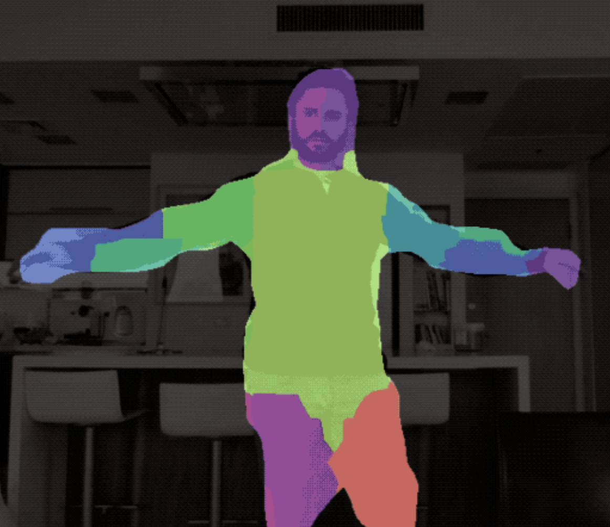
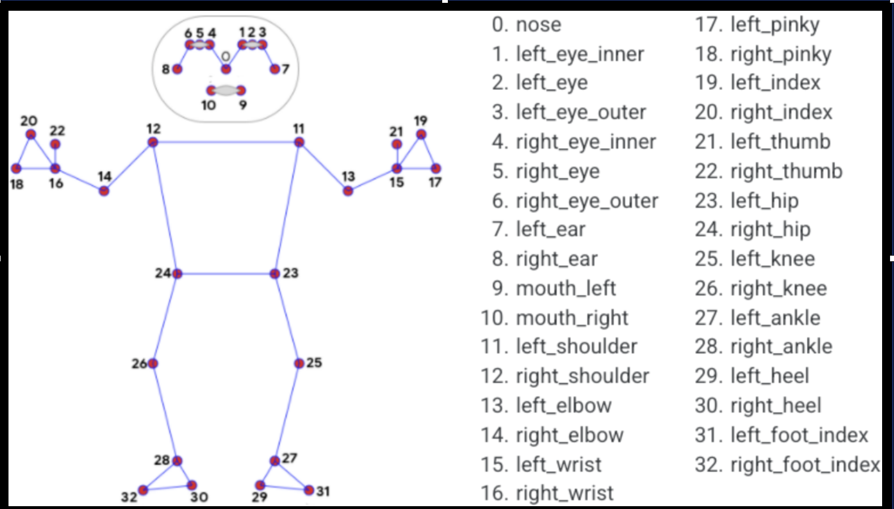
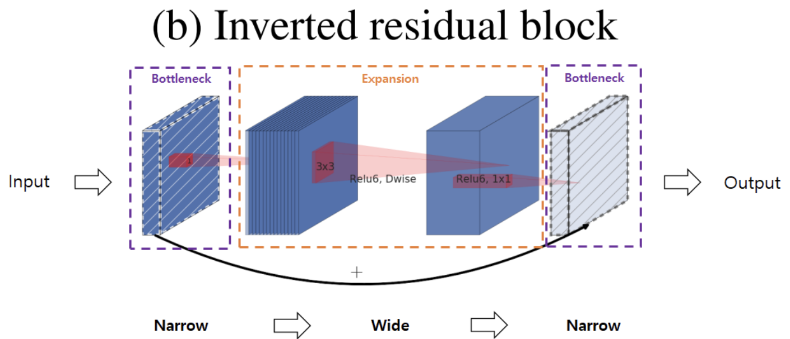
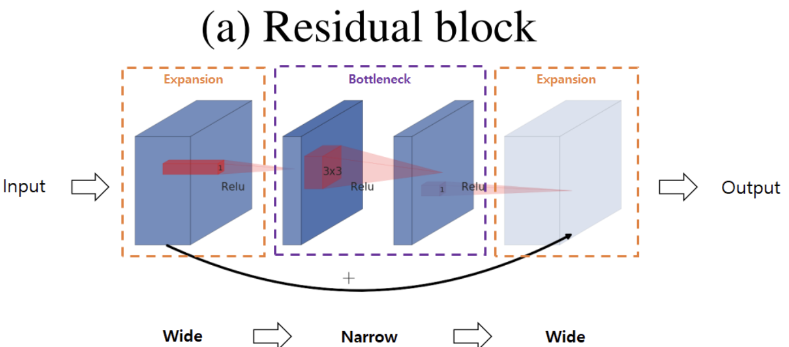
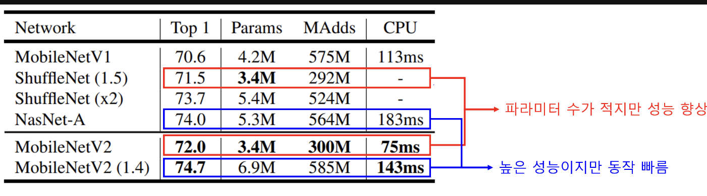
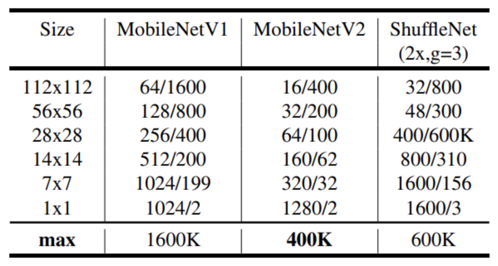

# Go Dance Up App 프로젝트
# Human Part Segmentation
# Exploration_3 참고

# 1. 아이디어

* 필터링 기능을 StyleGAN 모델을 활용하여 구현하려고 했으나, 출력 속도로 인해 방향 변경
* 사용자 영상을 Human Segmentation 하여 각 신체 부위의 Mask에 자체 준비한 캐릭터의 신체 부위 이미지 대입
* 이미지 대입은 랜드마크로 범위 설정, mask의 범위 설정하여 매칭할 계획

[Segmentation img]

[Randmark img]

---

# 2. Model & Module

* Backbone & Architecture : MobileNetV2 (Feature Extraction, Encoder), Unet(Instance Segmentation, Decoder)
* DataSet : Pascal voc 2010 (.mat 형식, person 객체, person parts)
* 모듈 파일 구성 : MobileNetV2.py , Unet.py, base_model.py, train.py, dataload.py, Person_extraction.py > 추후 몇가지 모델 비교 예정 (ResNet, UnetPlus)

[MobilNetV2 img]

---

# 3. 모듈 상세 설명 (진행한 부분까지)

1. base_model.py : Pytorch의 모듈을 상속 기능 사용하여 모델들의 공통적인 기능 제공

<class BaseModel(nn.Module)
* method Summary : 모델의 구조를 요약해서 출력, FLOPs 출력 가능, 모델의 복잡성 계산에 유용
(FLOPs : 컴퓨터의 성능을 수치로 나타내는 단위) 

* 가중치 초기화 및 사전 훈련 모델 or 가중치 로드 메소드

<class BaseBackbone>
* def load_pretrained_model_extended : 백본(MobileNetV2)를 사용
(입력 채널이 다른 경우에 사용)

---
---

2. MobileNetV2.py : 백본으로 사용, 인코더, 특징 추출
* manifold 가설 기반 (저차원 정보도 고차원 정보를 갖고 있다는 가설)
* BottleNeck layer, residual block 사용, InvertedResidual
* 모바일 등 디바이스 사용에 최적화 된 경량 모델 (파라미터 적음, 병목 레이어(bottelNeck))

---

* def _make_devisible(v, divisor, min_value=None) : 계산의 효율을 높이기 위해 'alpha'를 사용하여 채널 수를 튼ㄱ정 배수로 유지 (GPU 특정 배수 효율 상승)

<class InvertedResidual(nn.module)> 
* manifold of interest 기반으로 residual block, bottleNeck layer를 사용하여 모델을 깊게하고 연산량을 감소시키는 구조
* bottleNeck Layer에서 선형/비선형 레이어 비교 (Relu), 비선형이 성능이 더 좋은 것으로 확인

<class MobileNetV2(nn.module)>
* 초기화 메소드, 위 메소드와 class를 사용할 수 있는 전체 흐름 정의

---
---

3. Unet.py : Segmentation을 위해 Decoder 구조 사용 (Transpose Conv)
<class Decoder(nn.module)> 
* Transpos Conv로 업샘플링

<class Unet(BaseModel)
* 전체 레이어 구성 
* ResNet도 백본으로 활용할 수 있게 구성

---
---

# 4. 진행 예정

* Train.py 작성

* dataload.py & person_extraction.py : Pascal voc 2010 mat 형식의 데이터 선별 및 전처리

* 훈련 및 검증

---

# 5. 예상되는 변수

* 영상에 실시간 추적 및 대입 가능할지?
* 옷에 가려지는 부위 자세하게 Segmentatino 할지?
* 분할 된 mask 들의 랜드마크와 맞는 범위 설정 가능할지?

