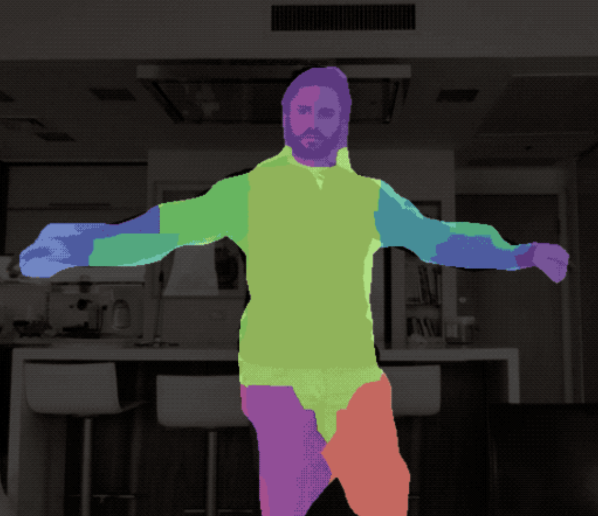

# Go Dance Up App 프로젝트 (Flutter)
# Flutter UI & UX

# 1. 기능
[기능 이미지]

* 기능 : 업로드 영상 평가 , 실시간 평가, 필터링, 학습 모드
* 엔드 포인트, upload_and_evaluate (업로드 및 평가) : npy 파일로 포즈 매칭 (model: MediaPipe)
* 윤곽선 Canny model
* 필터링 : MobileNetV2(Encoder), Unet(Decoder)

[필터링 이미지]

* 위에 이미지 처럼 분할 된 영역에 준비한 Parts 별 캐릭터 이미지 대입 예정

---
---

# 2. 진행 상황

홈 화면, 로그인 화면, 현재 업로드 화면, 평가 점수 출력 화면 (로그인 화면 진행중)

<디바이스 화면>

[메인 > Login > main > upload > score]

---

---
---

# 3. 진행 예정

---
---

# 4. 예상되는 변수(질문)

1. 디바이스 마다 화면 비율이 다른데 각 기기에 UI 크기 적용은 어떻게 맞추는지?
2. 다른 하드웨어와 화면 공유를 할 수 있는지? (학습모드에서 Tv, Com, Labtop)
3. 모델들 탑재하는 부분을 자세히 알고 싶습니다 (MediaPipe 평가기 엔드포인트로 탑재)

* 1차 멘토링 전까지 추가 질문들 정리 하겠습니다!

